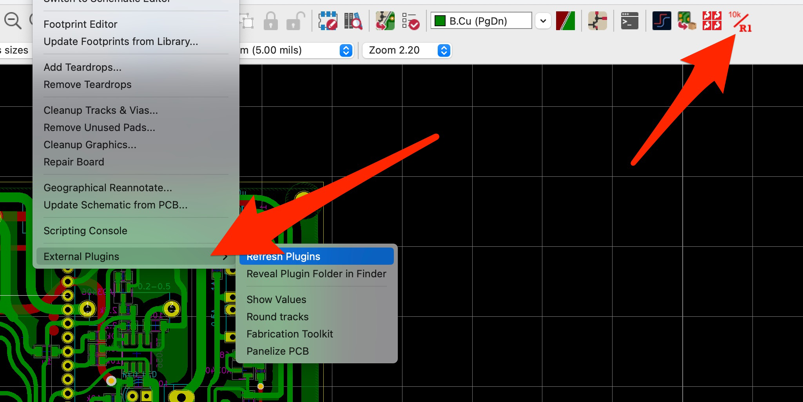

# Installation

Symlink folders into `/Users/%name%/Documents/kicad/7.0/scripting/plugins/`

Example `ln -s %path_to_source%/kicad-plugins/show_values/ /Users/%name%/Documents/kicad/7.0/scripting/plugins/show_values`

Refresh plugins.

